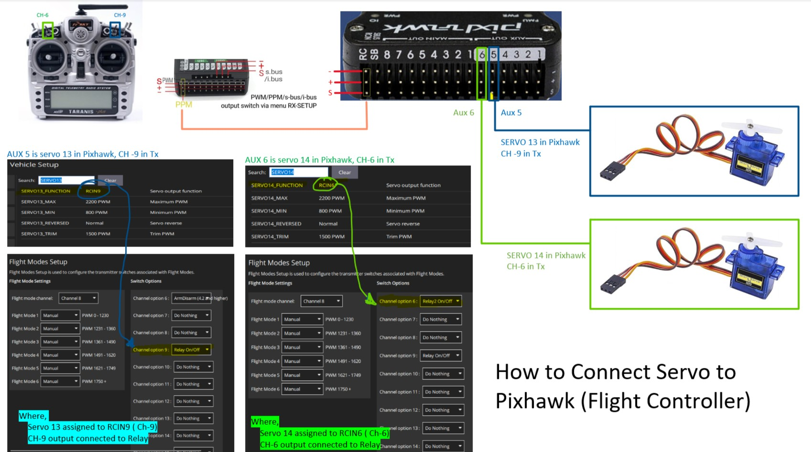

# Pixhawk Servo Connection

This repository provides a simple guide to connect and configure servos with the Pixhawk flight controller. The goal is to demonstrate how to control servos via RC transmitter channels and set up relay functionality.

---

## Contents

- `how_to_connect_servo_to_pixhawk.jpg`: Wiring diagram for the servo setup.
- `README.md`: Documentation for setup and configuration.
- `LICENSE`: License information for this repository.

---

## Overview

This guide explains how to configure servos on AUX pins of Pixhawk using RC transmitter channels:

- **Channel 6 (CH-6)** → Servo 14 (AUX 6)
- **Channel 9 (CH-9)** → Servo 13 (AUX 5)

### Key Steps

1. **Wiring**
   - Refer to the wiring diagram: `how_to_connect_servo_to_pixhawk.jpg`.
   - Connect servos to AUX 5 and AUX 6 on the Pixhawk.

2. **Assign Servo Functions**
   - Use QGroundControl or Mission Planner to configure the AUX pins:
     - Servo 13 → RCIN9
     - Servo 14 → RCIN6

3. **Flight Mode Setup**
   - Configure transmitter switches for relay functionality:
     - Channel 8 → Relay On/Off for Servo 13.
     - Channel 9 → Relay On/Off for Servo 14.

---

## Configuration Files

- **QGroundControl_settings.txt**:
  - Example configuration for mapping servos and channels.
- **MissionPlanner_params.param**:
  - Parameters to directly upload to Mission Planner.

---

## Wiring Diagram



---

## License

This project is licensed under the [MIT License](LICENSE).

---

### How to Use This Repository

1. Clone the repository:
   ```bash
   git clone https://github.com/your_username/pixhawk-servo-connection.git
