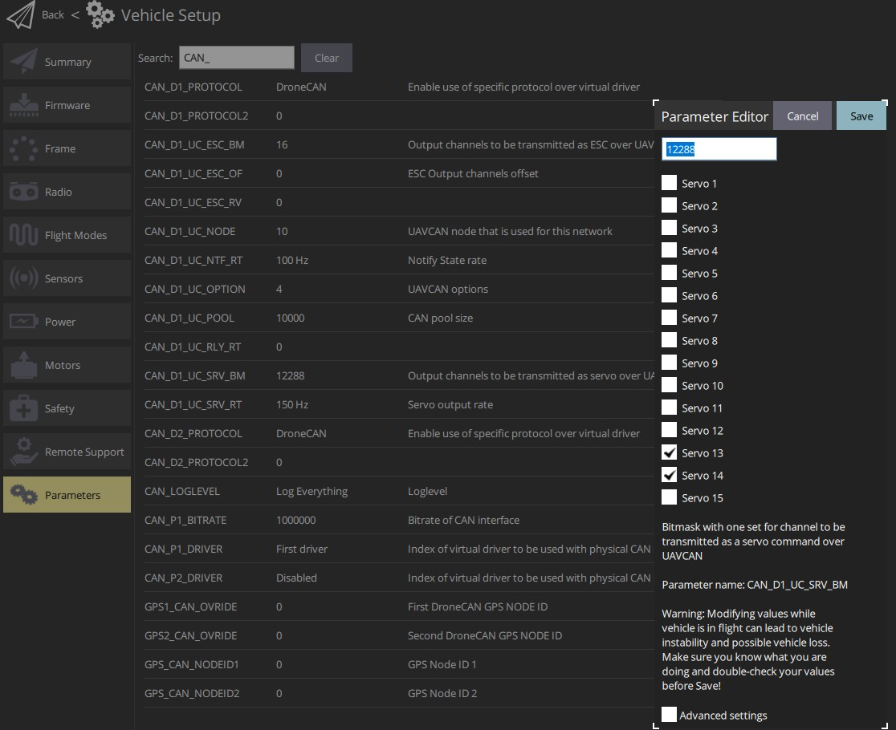

# Pixhawk-DroneCAN Connection Guide 🚀

   This branch provides a guide to connect and configure the **DroneCAN** module with the Pixhawk flight controller. 
   For a detailed understanding of servo-to-Pixhawk connections, refer to the **Pixhawk-Servo** branch.

You can access the **Pixhawk-Servo** branch here:  
[Pixhawk-Servo Branch on GitHub](https://github.com/Bhanutejagiddaluru/ArduPilot/tree/Pixhawk-Servo)

---

## Circuit Wiring Diagram

The following circuit diagram shows how to connect the **DroneCAN** module to the Pixhawk:

---

## Step-by-Step Guide 🔧

### Step 1: Flash the DroneCAN Module

#### About the Module
The module used here is the **AP_Periph DroneCAN to PWM Adapter**:  
**Model**: CAN-L4-PWM  
**Features**:
- Supports **DroneCAN Protocol**
- Provides **up to 9 PWM outputs**
- Works as a CAN Node for seamless communication with the Pixhawk
- Official Documentation: [Matek Systems CAN-L4-PWM](https://www.mateksys.com/?portfolio=can-l4-pwm)

---

### Step 2: Flashing the Module with Firmware

#### Download the Required Software

1. **Download the Firmware**:
   - Visit the [ArduPilot firmware site](https://firmware.ardupilot.org/AP_Periph/latest/MatekL431-DShot/).
   - Download the file: **`AP_Periph.bin`**.

2. **Install the DroneCAN GUI Tool**:
   - Download the GUI Tool from [DroneCAN GUI Tool](https://firmware.ardupilot.org/Tools/CAN_GUI/).
   - For Windows: Download and install **`Dronecan_gui_tool-1.2.27-win64.msi`**.

---

### Step 2.1: Using the DroneCAN GUI Tool to Flash Firmware

#### Flashing Steps

1. **Connect the Module:**
   - Connect the **DroneCAN module** to the Pixhawk CAN port.
   - Plug in the Pixhawk to your PC using a USB cable.
   - Ensure all connections are secure and the module has power (refer to the wiring diagram for setup).

2. **Open the DroneCAN GUI Tool**:

   

   - **Set Local Node ID**:
     - Uncheck the "Set local node ID" box in the GUI tool. This enables the tool to operate in **anonymous mode** for detecting connected DroneCAN devices.
   - **Verify Connected Nodes**:
     - The **Online Nodes** section will list all detected devices. Look for the **MatekL431-DShot** node with details like Node ID, Name, and Status.

3. **Select the Node and Begin Firmware Update**:

   

   - Select the **MatekL431-DShot** node in the **Online Nodes** list.
   - Click on **Update Firmware** to initiate the firmware flashing process.

4. **Flash the Firmware**:
   - Select the previously downloaded **`AP_Periph.bin`** file.
   - Ensure the module's **Mode** changes to "Software Update" during the process.
   - Once the firmware is flashed successfully, the module's **Mode** will change back to "Operational OK" with a healthy status.

---

### Step 2.2: Fetch and Modify Parameters

1. **Fetch Parameters from the Module**:

   

   - Click the **Fetch All** button to retrieve all parameters from the DroneCAN module.
   - Wait until the fetching process is complete, and the full list of parameters is displayed.

2. **Modify Key Parameters**:

   

   Update the following parameters based on your requirements:

   | **Parameter**          | **Value** |
   |-------------------------|-----------|
   | `OUT_BLH_MASK`          | 0         |
   | `ESC_PWM_TYPE`          | 0         |
   | `OUT5_FUNCTION`         | 63        |
   | `OUT6_FUNCTION`         | 64        |

   **Explanation**:
   - **`OUTn_FUNCTION`**: Set to `50 + Servo Number` (e.g., `OUT5_FUNCTION = 63` for Servo 13, `OUT6_FUNCTION = 64` for Servo 14).
   - **`OUT_BLH_MASK`**: Set to `0` to disable the use of DShot.
   - **`ESC_PWM_TYPE`**: Set to `0` for normal PWM signals.

   **Reboot the Module**:
   - After modifying the parameters, restart the DroneCAN module to apply the changes.
   - The module will initialize with the updated configuration.
   
   - You have successfully flashed and configured the DroneCAN module to work with Pixhawk. This setup allows seamless integration of PWM outputs via DroneCAN for Servo 13 and Servo 14.
---

### Step 3: Configuring the DroneCAN Module in Pixhawk

After flashing and updating the DroneCAN module, the next step is to configure your Pixhawk flight controller to recognize and utilize the DroneCAN module.

#### Parameters in the Flight Controller

Configure the following parameters in **Mission Planner** or **QGroundControl** to enable communication and functionality with the DroneCAN module:

| **Parameter**          | **Value**                     |
|-------------------------|-------------------------------|
| `CAN_D1_PROTOCOL`       | 1 (Enable DroneCAN Protocol) |
| `CAN_P1_DRIVER`         | 1 (Enable CAN Bus Driver)    |
| `CAN_D1_UC_ESC_OF`      | 4                             |
| `CAN_D1_UC_ESC_BM`      | Leave default or select custom values |
| `CAN_D1_UC_SRV_BM`      | Enable Servo 13 and Servo 14 |
| `BRD_SAFETYENABLE`      | 0 (Disable Safety Switch)    |

---

#### Selecting Servos

1. Open the **Parameters** tab in your configuration software (e.g., Mission Planner or QGroundControl).
2. Modify the **`CAN_D1_UC_SRV_BM`** parameter to enable specific servos:
   - Enable **Servo 13** and **Servo 14**.
   - These correspond to AUX pins 5 and 6, respectively.

Refer to the image below for the correct parameter settings:

---

#### Finalizing Configuration

1. Save the updated parameters in the configuration tool.
2. Reboot the Pixhawk to apply the changes.
3. Verify that the DroneCAN module and servos are functioning correctly.

---

## Conclusion

Congratulations! You have successfully set up and configured the **DroneCAN** module with your Pixhawk. This setup allows for seamless communication between the module and flight controller, enabling advanced functionality.

For any troubleshooting, refer to the official documentation or community forums.

---
