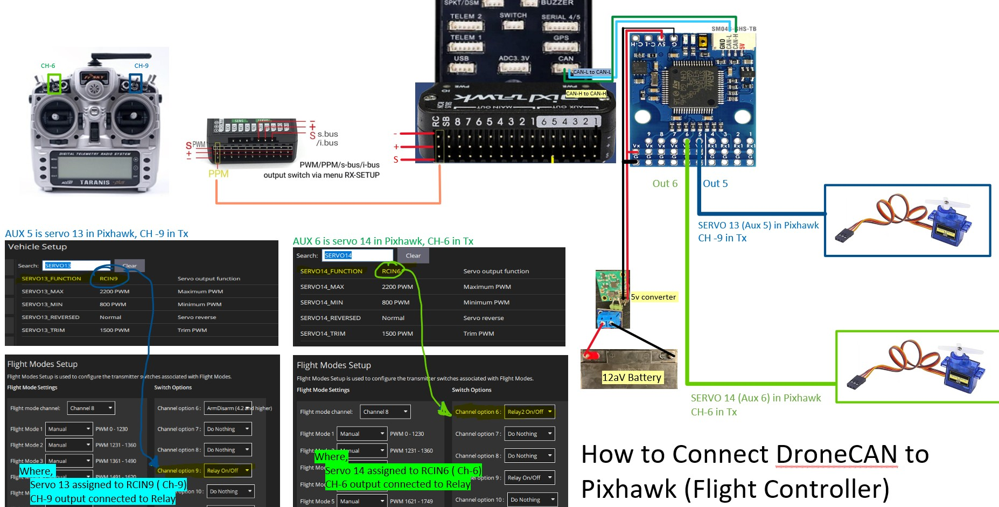
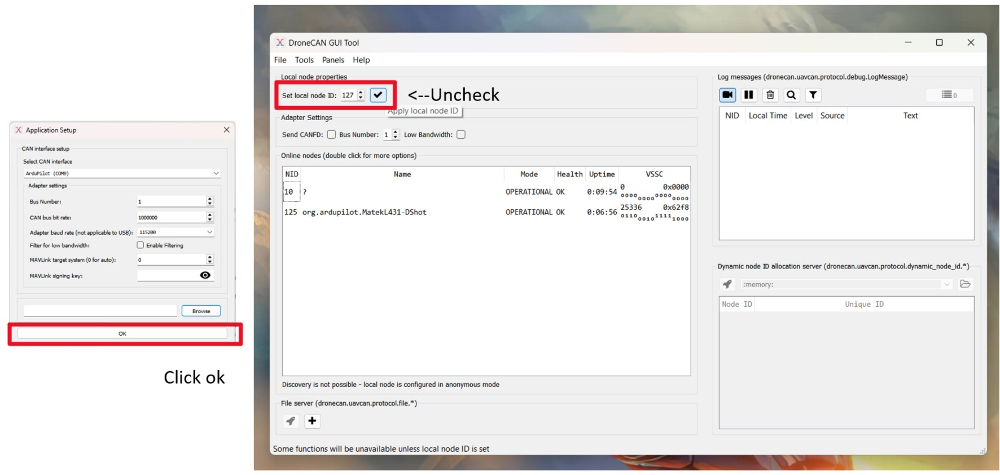
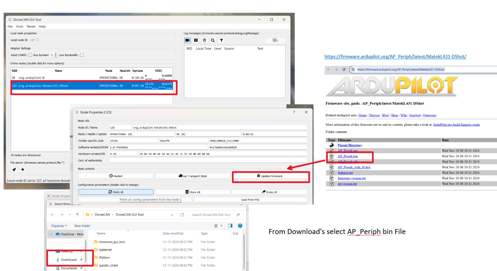
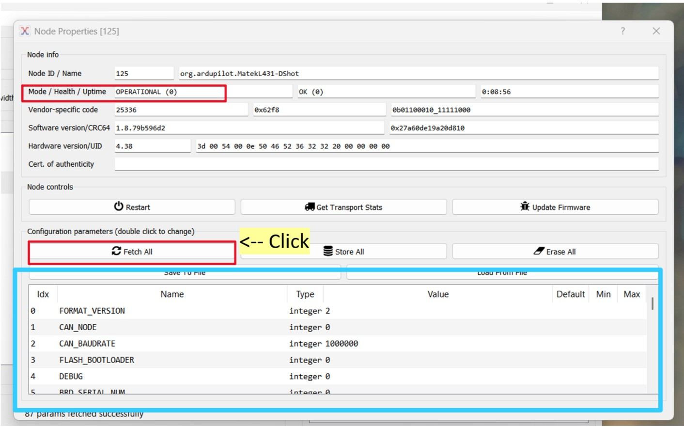
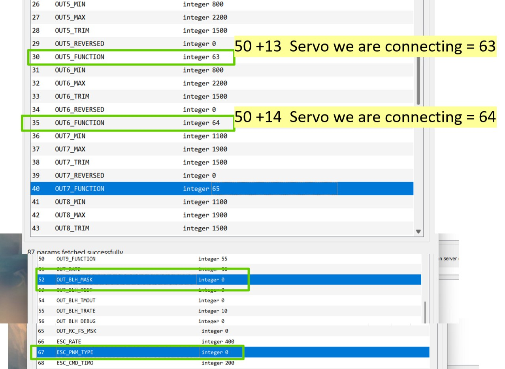
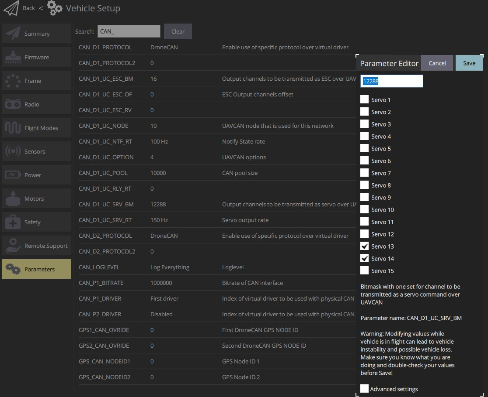

# Pixhawk-DroneCAN Connection Guide 🚀

This branch provides a guide to connect and configure the **DroneCAN** module with the Pixhawk flight controller. For a detailed understanding of servo-to-Pixhawk connections, refer to the **Pixhawk-Servo** branch.

---

## Circuit Wiring Diagram

The following circuit diagram shows how to connect the **DroneCAN** module to the Pixhawk:

---

## Step-by-Step Guide 🔧

### Step 1: Flash the DroneCAN Module

#### About the Module
The module used here is the **AP_Periph DroneCAN to PWM Adapter**:  
**Model**: CAN-L4-PWM  
**Features**:
- CAN Node
- DroneCAN Protocol
- Supports up to **9 PWM outputs**
- Official Documentation: [Matek Systems CAN-L4-PWM](https://www.mateksys.com/?portfolio=can-l4-pwm)

#### Flashing Software to the Module
1. **Download the Firmware:**
   - Visit the [ArduPilot firmware site](https://firmware.ardupilot.org/AP_Periph/latest/MatekL431-DShot/).
   - Download the **`AP_Periph.bin`** file.

2. **Install the DroneCAN GUI Tool:**
   - Download the GUI Tool: [DroneCAN GUI Tool](https://firmware.ardupilot.org/Tools/CAN_GUI/).
   - For Windows: Download and install **`Dronecan_gui_tool-1.2.27-win64.msi`**.

---

### Step 2: Using the DroneCAN GUI Tool

#### Flashing Steps
1. Open the **DroneCAN GUI Tool** after installation.

2. **Connect the Module:**
   - Connect the DroneCAN module to your PC using a USB-CAN adapter.
   - Ensure proper wiring and power supply.

3. **Set Up Local Node ID:**
   - Open the GUI tool interface and **uncheck** the "Set local node ID" box.
   - Verify connected nodes in the **Online Nodes** section.

4. **Flash the Firmware:**
   - Select your connected node from the list.
   - Click **Update Firmware** and choose the **`AP_Periph.bin`** file downloaded earlier.
   - Wait for the update process to complete.

### Step 1: Open the DroneCAN GUI Tool

After installing the **DroneCAN GUI Tool**, open it and follow these steps:

- **Set Local Node ID**:  
  - Uncheck the "Set local node ID" box.  
  - This ensures the tool operates in anonymous mode for detecting connected DroneCAN devices.

- **Verify Connected Nodes**:  
  - Once the module is connected, the tool will list all detected nodes under the **Online Nodes** section.  
  - You should see your module listed with details such as **Node ID**, **Name**, and **Status**.

### Step 2: Connect the DroneCAN Module

- **Connect the Module:**  
  - Attach your DroneCAN module to your PC using a USB-CAN adapter.  
  - Ensure that all wiring is secure and that the module has sufficient power.  

- **Detect the Node:**  
  - After connecting, the **DroneCAN GUI Tool** will display the detected module in the **Online Nodes** section.  
  - Verify the **Node ID**, **Mode**, and **Health Status** to ensure the connection is successful.

### Step 3: Verify and Prepare for Firmware Update

- **Select the Node:**  
  - Click on the node listed in the **Online Nodes** section to view its details.  
  - Ensure the module's **Mode** is "Operational OK" and the health status is displayed as "OK".

- **Start Firmware Update:**  
  - Click on **Update Firmware** to begin updating the module's software.

### Step 4: Update the Firmware

- **Select the Firmware File:**  
  - Choose the previously downloaded `AP_Periph.bin` file from your system.  
  - Confirm the selection and start the firmware update process.

- **Wait for Completion:**  
  - The DroneCAN GUI Tool will flash the firmware onto the module.  
  - Once the process completes, the module will reboot automatically.
---

### Step 3: Configuring the DroneCAN Module in Pixhawk

After updating the DroneCAN module, configure the Pixhawk flight controller to recognize and utilize the module.

#### Parameters in Flight Controller
Set the following parameters in **Mission Planner** or **QGroundControl**:

| **Parameter**          | **Value** |
|-------------------------|-----------|
| `CAN_D1_PROTOCOL`       | 1         |
| `CAN_P1_DRIVER`         | 1         |
| `CAN_D1_UC_ESC_OF`      | 4         |
| `CAN_D1_UC_ESC_BM`      | Select appropriate values |
| `CAN_D1_UC_SRV_BM`      | Select Servo 13 and Servo 14 |
| `BRD_SAFETYENABLE`      | 0         |

#### How to Select Servos
- Use the **`CAN_D1_UC_SRV_BM`** parameter to enable **Servo 13** and **Servo 14**.
- Refer to the image below for setting the parameters:

---

### Step 4: Testing and Resetting

1. Reset the Pixhawk flight controller after configuring the parameters.
2. Ensure all connections are secure and the module is powered correctly.
3. Test the functionality of Servo 13 and Servo 14 using your RC transmitter.

---

## Conclusion

Congratulations! You have successfully set up and configured the **DroneCAN** module with your Pixhawk. This setup allows for seamless communication between the module and flight controller, enabling advanced functionality.

For any troubleshooting, refer to the official documentation or community forums.

---
